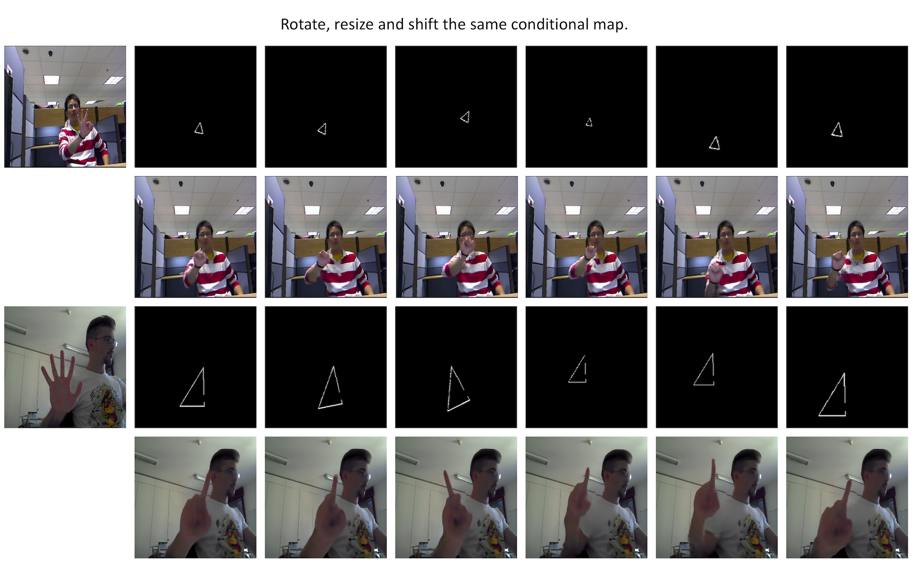
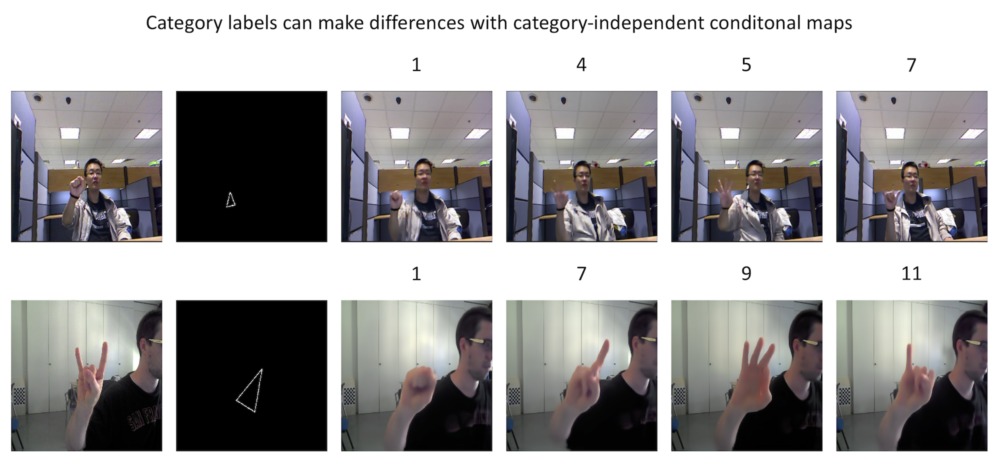

## TriangleGAN

A new gesture-to-gesture translation framework. [Gesture-to-Gesture Translation in the Wild via Category-Independent Conditional Maps](https://arxiv.org/pdf/1907.05916.pdf), to be presented in ACM International Conference on Multimedia, 2019.


### 1.Dataset preparing

 - Original Dataset
   - [NTU Hand Gesture Dataset](https://drive.google.com/file/d/1f8tUHid1KmnwbgskGMXmobOxMfbxIgHM/view)
   - [Senz3d Gesture Dataset](http://lttm.dei.unipd.it/downloads/gesture/#senz3d)

[More details >>>](./datasets/README.md)

### 2.Installation

We provide an user-friendly configuring method via [Conda](https://docs.conda.io/en/latest/) system, and you can create a new Conda environment using the command:

```
conda env create -f environment.yml
```

### 3.Train/Test

1.Download dataset and copy them into `./datasets`
 
2.Modify the scripts to train/test:

 - Training

```
sh ./scripts/train_trianglegan_ntu.sh <gpu_id>
sh ./scripts/train_trianglegan_senz3d.sh <gpu_id>
```
 - Testing

```
sh ./scripts/test_trianglegan_ntu.sh <gpu_id>
sh ./scripts/train_trianglegan_senz3d.sh <gpu_id>
```

3.The pretrained model is saved at `./checkpoints/{model_name}`. Check [here](https://drive.google.com/open?id=1UmZ2dgxyphCeeYKz4Opjh_Oq8NogSEev) for all the available TriangleGAN models.

4.We provide an implementation of GestureGAN, ACM MM 2018 [[paper]](https://arxiv.org/pdf/1808.04859.pdf)|[[code]](https://github.com/Ha0Tang/GestureGAN).

```
sh ./scripts/train_gesturegan_ntu.sh <gpu_id>
sh ./scripts/train_gesturegan_senz3d.sh <gpu_id>
```

### 4.Evaluation

[More Details >>>](./eval/README.md)

### 5.Visual Results





[More Details >>>](./figures/README.md)

### Acknowledgment

This code is based on the [pytorch-CycleGAN-and-pix2pix](https://github.com/junyanz/pytorch-CycleGAN-and-pix2pix). Thanks to the contributors of this project.

### Related Work
- [Pose Guided Person Image Generation](https://arxiv.org/pdf/1705.09368.pdf), NIPS 2017, [[Tensorflow]](https://github.com/charliememory/Pose-Guided-Person-Image-Generation)
- [GANimation: Anatomically-aware Facial Animation from a Single Image](https://arxiv.org/pdf/1807.09251.pdf), ECCV 2018, [[PyTorch]](https://github.com/albertpumarola/GANimation)
- [StarGAN: Unified Generative Adversarial Networks for Multi-Domain Image-to-Image Translation](https://arxiv.org/pdf/1711.09020.pdf), CVPR 2018, [[PyTorch]](https://github.com/yunjey/stargan)
- [GestureGAN for Hand Gesture-to-Gesture Translation in the Wild](https://arxiv.org/pdf/1808.04859.pdf), ACM MM 2018, [[Pytorch]](https://github.com/Ha0Tang/GestureGAN)
- [Animating Arbitrary Objects via Deep Motion Transfer](https://arxiv.org/pdf/1812.08861.pdf), CVPR 2019, [[Pytorch]](https://github.com/AliaksandrSiarohin/monkey-net)

### References

If you take use of our datasets or code, please cite our papers:

```
@article{liu2019gesture,
  title={Gesture-to-gesture translation in the wild via category-independent conditional maps},
  author={Liu, Yahui and De Nadai, Marco and Zen, Gloria and Sebe, Nicu and Lepri, Bruno},
  journal={arXiv preprint arXiv:1907.05916},
  year={2019}
}
```

If you have any questions, please contact me without hesitation (yahui.liu AT unitn.it).
