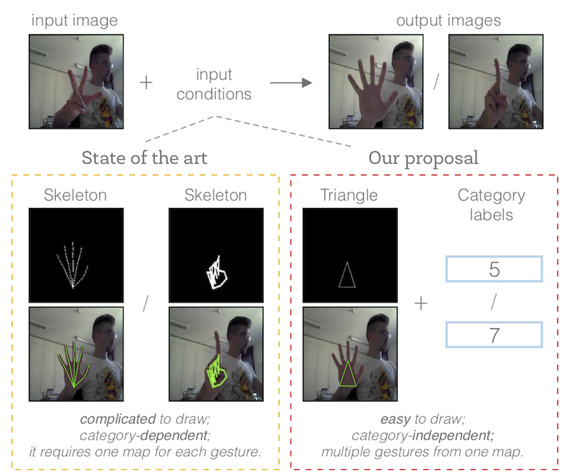

## TriangleGAN

A new gesture-to-gesture translation framework. Gesture-to-Gesture Translation in the Wild via Category-Independent Conditional Maps, to be presented in ACM MultiMedia 2019.




### 1.Dataset preparing

 - Original Dataset
   - [NTU Hand Gesture Dataset](https://drive.google.com/file/d/1f8tUHid1KmnwbgskGMXmobOxMfbxIgHM/view)
   - [Senz3d Gesture Dataset](http://lttm.dei.unipd.it/downloads/gesture/#senz3d)

[More details >>>](./datasets/README.md)

### 2.Installation

We provide an user-friendly configuring method via [Conda](https://docs.conda.io/en/latest/) system, and you can create a new Conda environment using the command:

```
conda env create -f environment.yml
```

### 3.Train/Test

 1.Download dataset and copy them into `./datasets`
 
 2.Modify the scripts to train/test:

  - Training

```
sh ./scripts/train_trianglegan_ntu.sh
sh ./scripts/train_trianglegan_senz3d.sh
```
 - Testing

```
sh ./scripts/test_trianglegan_ntu.sh
sh ./scripts/train_trianglegan_senz3d.sh
```

3.The pretrained model is saved at `./checkpoints/{model_name}`. Check [here](https://drive.google.com/open?id=1UmZ2dgxyphCeeYKz4Opjh_Oq8NogSEev) for all the available TriangleGAN models.

### 4.Evaluation

[More Details >>>](./eval/README.md)

### 5.Visual Results

[More Details >>>](./figures/README.md)

### Acknowledgment

This code is based on the [pytorch-CycleGAN-and-pix2pix](https://github.com/junyanz/pytorch-CycleGAN-and-pix2pix). Thanks to the contributors of this project.

### References

If you take use of our datasets or code, please cite our papers (coming soon):

```

```

If you have any questions, please contact me without hesitation (yahui.liu AT unitn.it).