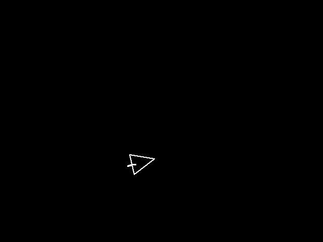

### 1.Dataset Tree:

```
 ntu_dataset/senz3d_dataset
   |__ images-full
   |__ images-part
   |__ keypoint
   |__ skeleton
   |__ boundary
   |__ triangle
   |__ test.part.lst
   |__ test.full.lst
   |__ train.part.lst
   |__ train.full.lst
```

### 2.Description:

|File/Folder Name|Description|Number/Lines|Others|
|:-----|:-----|:-----:|:----:|
|`ntu_dataset`|[NTU Hand Gesture Dataset](https://drive.google.com/file/d/1f8tUHid1KmnwbgskGMXmobOxMfbxIgHM/view), 10 images for each gesture with 10 kinds of gestures collected from 10 people.| 1000 | - |
|`senz3d_dataset`|[Senz3D Gesture Dataset](http://lttm.dei.unipd.it/downloads/gesture/#senz3d), 30 images for each gesture with 11 kinds of gestures collected from 4 people.| 1320 | - |
|`image-full`|All of the images in the public dataset.| 1000(ntu)/1320(senz3d) | color |
|`image-part`|Part of the images in public dataset, including the images that gesture can be detected via [OpenPose](https://github.com/CMU-Perceptual-Computing-Lab/openpose).|647(ntu)/494(senz3d)| color, resized | 
|`keypoint`|Key-points map of hand gesture.|647(ntu)/494(senz3d)| binary |
|`skeleton`|Skeleton map of hand gesture.|647(ntu)/494(senz3d)| binary |
|`boundary`|Rough boundary map of hand gesture.|0(ntu)/1320(senz3d)| binary |
|`triangle`|Rough triangle map of hand gesture.|1000(ntu)/1320(senz3d)| binary |
|`test.part.lst`|Testing list with `image-part`|9600(ntu)/12800(senz3d)|-|
|`test.full.lst`|Testing list with `image-full`|13500(ntu)/16500(senz3d)|-|
|`train.part.lst`|Training list with `image-part`|84636(ntu)/135504(senz3d)|-|
|`train.full.lst`|Training list with `image-full`|44100(ntu)/138864(senz3d)|-|

 - **Notes**:
   - Keypoints, Skeleton: based-on the public project [OpenPose](https://github.com/CMU-Perceptual-Computing-Lab/openpose).
Notes: OpenPose can't detect all hand gestures in the two datasets.
   - Boundary, Triangle: manually annotated.

 - **Additional**:

 In NTU Dataset,  it can make the model confused that what is the real direction of hand gesture, as shown in the following table. We ask the users to provide some more information to confirm that.

|Image|Triangle|Modified Triangle|
|:----:|:----:|:----:|
||||

### 3.Download

 You can download the dataset from [Google Drive](), [zenodo]() or [Baidu Yunpan]() (psw: ).  
