## Diversity in Senz3D

### 1.Category labels

 Category labels can make differences with category-independent conditonal map.

 - Full - Triangle

|Source Image|Cond Map|1|3|5|7|9|11|
|----|----|----|----|----|----|----|----|
|||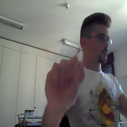|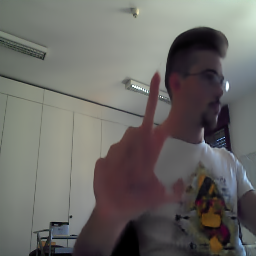|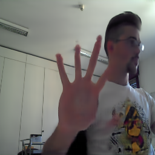||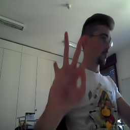|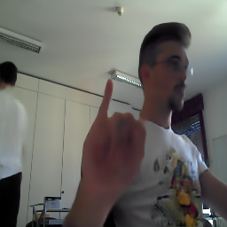|
||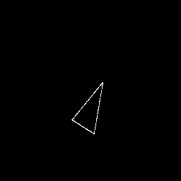|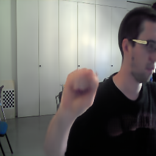|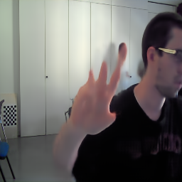|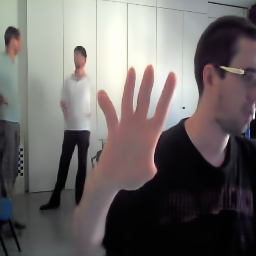|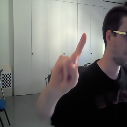|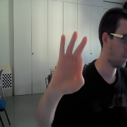|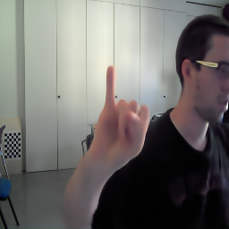|
||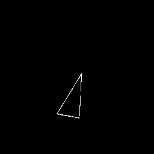|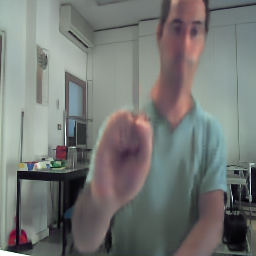|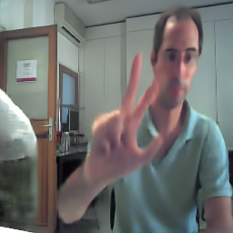|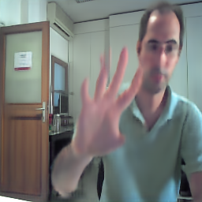|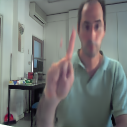|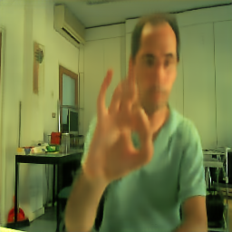|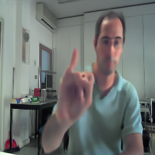|

 - Full - Boundary

|Source Image|Cond Map|1|3|5|7|9|11|
|----|----|----|----|----|----|----|----|
|||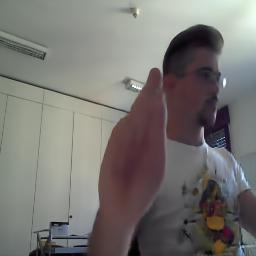|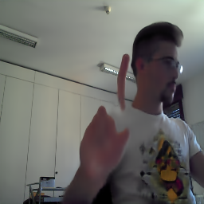|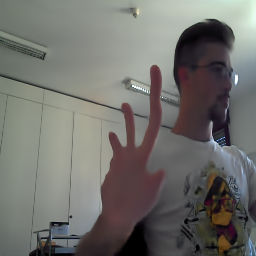||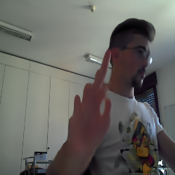|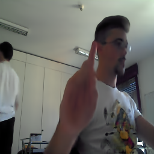|

 - Part - Skeleton

|Source Image|Cond Map|1|3|5|7|9|11|
|----|----|----|----|----|----|----|----|
|||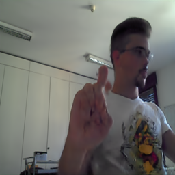|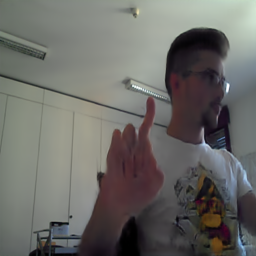|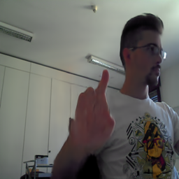||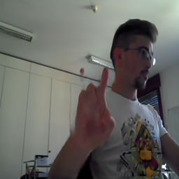|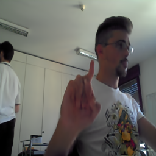|

### 2.Transformation of Cond Map

 - Rotate and Shift

|-|-|1|2|3|4|5|6|
|----|:----:|----|----|----|----|----|----|
|Source Image + Cond Map||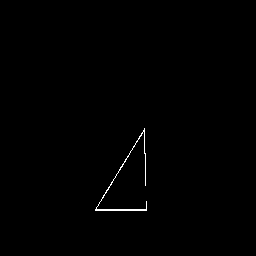|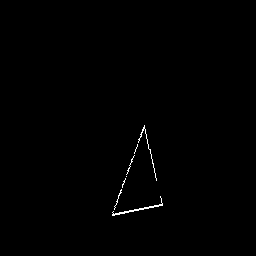|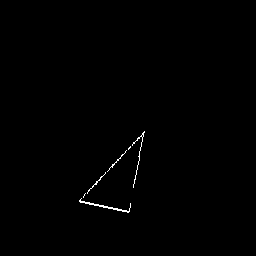|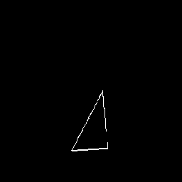|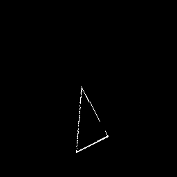|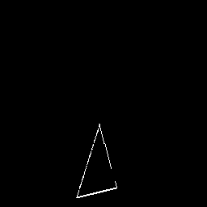|
|Output|x||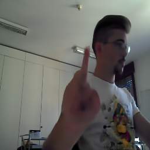|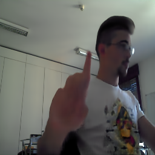|||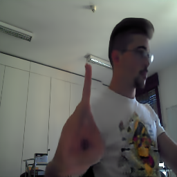|

 - Resize and Shift

|-|-|1|2|3|4|5|
|----|:----:|----|----|----|----|----|
|Source Image + Cond Map|||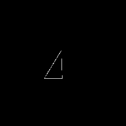|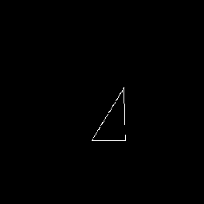|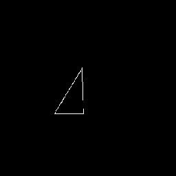|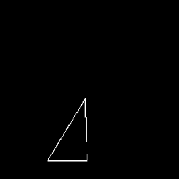|
|Output|x|||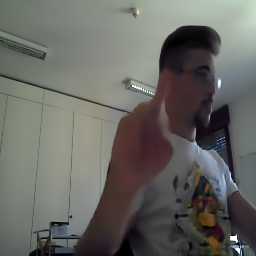|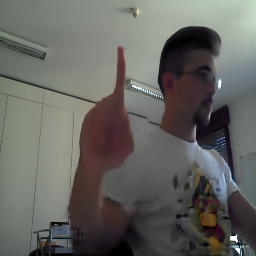||